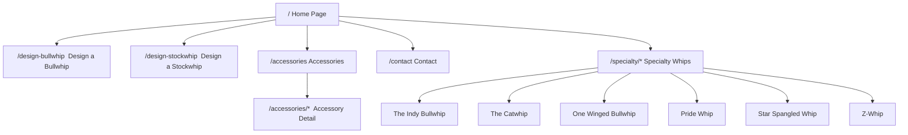
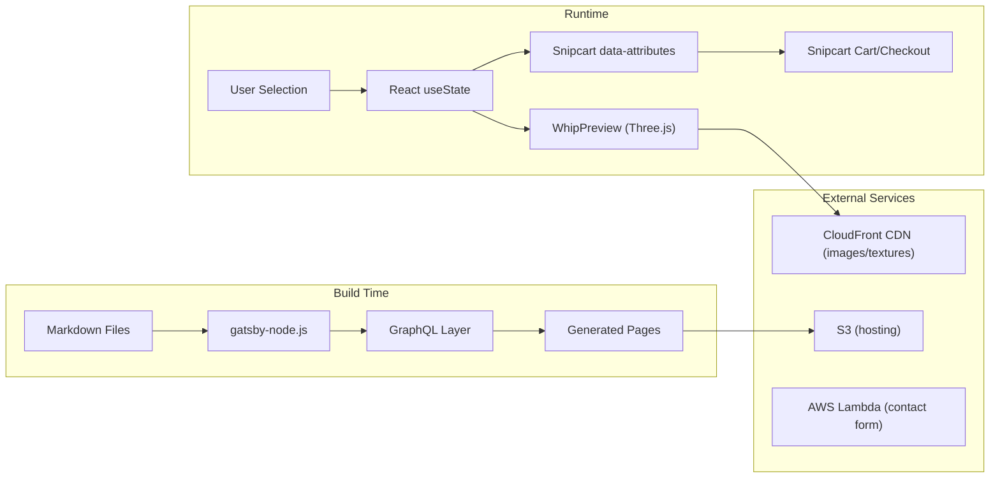
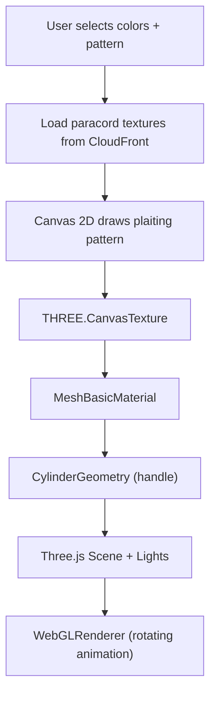

# WhipWorks.com - Architecture Diagram

## Site Map

```mermaid
graph TD
    HOME["/  Home Page"] --> DESIGN_BW["/design-bullwhip  Design a Bullwhip"]
    HOME --> DESIGN_SW["/design-stockwhip  Design a Stockwhip"]
    HOME --> ACCESSORIES["/accessories  Accessories"]
    HOME --> CONTACT["/contact  Contact"]
    HOME --> SPECIALTY_PAGES["/specialty/*  Specialty Whips"]

    ACCESSORIES --> ACC_DETAIL["/accessories/*  Accessory Detail"]
    SPECIALTY_PAGES --> INDY["The Indy Bullwhip"]
    SPECIALTY_PAGES --> CATWHIP["The Catwhip"]
    SPECIALTY_PAGES --> ONEWING["One Winged Bullwhip"]
    SPECIALTY_PAGES --> PRIDE["Pride Whip"]
    SPECIALTY_PAGES --> STAR["Star Spangled Whip"]
    SPECIALTY_PAGES --> ZWHIP["Z-Whip"]
```

## Component Architecture

```mermaid
graph TD
    subgraph Templates
        LAYOUT["Layout"]
        HEADER["Header (nav, cart, menu drawer)"]
        CONTENT["Content (centered container)"]
        SEO["SEO (meta tags)"]
        FOOTER["Footer"]
        PRODUCT_PAGE["ProductPage (specialty detail)"]
        SPECIALTY_PAGE["SpecialtyWhipPage"]
    end

    subgraph Organisms
        HERO["HeroCarousel (3-slide auto-play)"]
        SPEC_LIST["SpecialtyWhipList (featured whips)"]
        INSTA["InstagramFeed (image grid)"]
        CONTACT_FORM["ContactForm (react-hook-form → Lambda)"]
        BW_DESIGNER["BullwhipDesigner (accordion UI)"]
        SW_DESIGNER["StockwhipDesigner"]
        WHIP_PREVIEW["WhipPreview (Three.js 3D)"]
    end

    subgraph Molecules
        ACC_CARD["AccessoryCard"]
        PROD_IMAGES["ProductImages (gallery)"]
        BW_MODAL["BullwhipAddedModal"]
        POPPERS_MODAL["AddPoppersModal"]
    end

    subgraph Atoms
        CART_BTN["CartButton"]
        CUSTOM_LABEL["CustomizationLabel"]
        IMG_BTN["ImageButton"]
        ACCORDION["AccordionSection"]
        SPEC_CARD["SpecialtyWhipCard"]
    end

    LAYOUT --> HEADER
    LAYOUT --> CONTENT
    LAYOUT --> FOOTER
    HEADER --> CART_BTN

    BW_DESIGNER --> WHIP_PREVIEW
    BW_DESIGNER --> ACCORDION
    BW_DESIGNER --> CUSTOM_LABEL
    BW_DESIGNER --> BW_MODAL
    BW_MODAL --> POPPERS_MODAL
    BW_DESIGNER --> IMG_BTN

    SW_DESIGNER --> WHIP_PREVIEW
    SW_DESIGNER --> ACCORDION

    SPEC_LIST --> SPEC_CARD
    PROD_IMAGES --> IMG_BTN
```

## Data Flow

```mermaid
flowchart LR
    subgraph Build Time
        MD["Markdown Files"] --> GN["gatsby-node.js"]
        GN --> GQL["GraphQL Layer"]
        GQL --> PAGES["Generated Pages"]
    end

    subgraph Runtime
        USER["User Selection"] --> STATE["React useState"]
        STATE --> PREVIEW["WhipPreview (Three.js)"]
        STATE --> SNIPCART_BTN["Snipcart data-attributes"]
        SNIPCART_BTN --> SNIPCART["Snipcart Cart/Checkout"]
    end

    subgraph External Services
        CDN["CloudFront CDN (images/textures)"]
        S3["S3 (hosting)"]
        LAMBDA["AWS Lambda (contact form)"]
    end

    PREVIEW --> CDN
    PAGES --> S3
```

## Three.js 3D Preview Pipeline

```mermaid
flowchart TD
    COLORS["User selects colors + pattern"] --> LOAD["Load paracord textures from CloudFront"]
    LOAD --> CANVAS["Canvas 2D draws plaiting pattern"]
    CANVAS --> TEXTURE["THREE.CanvasTexture"]
    TEXTURE --> MATERIAL["MeshBasicMaterial"]
    MATERIAL --> CYLINDER["CylinderGeometry (handle)"]
    CYLINDER --> SCENE["Three.js Scene + Lights"]
    SCENE --> RENDER["WebGLRenderer (rotating animation)"]
```
