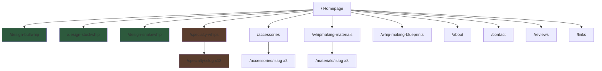
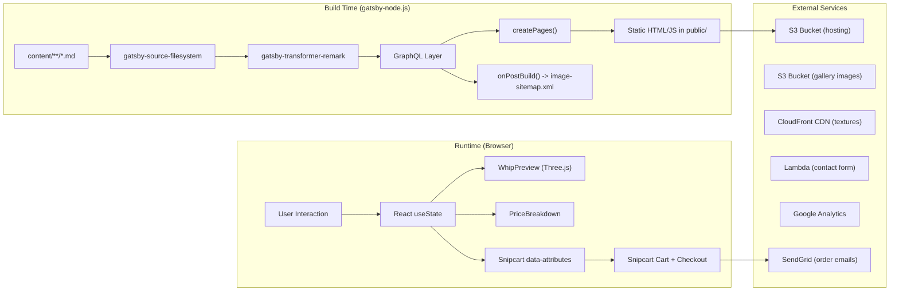
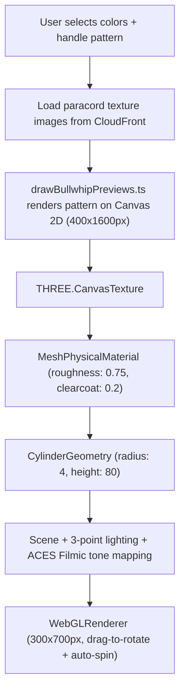
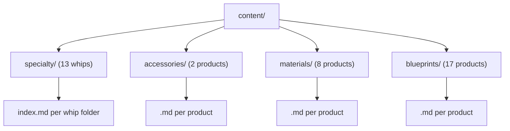
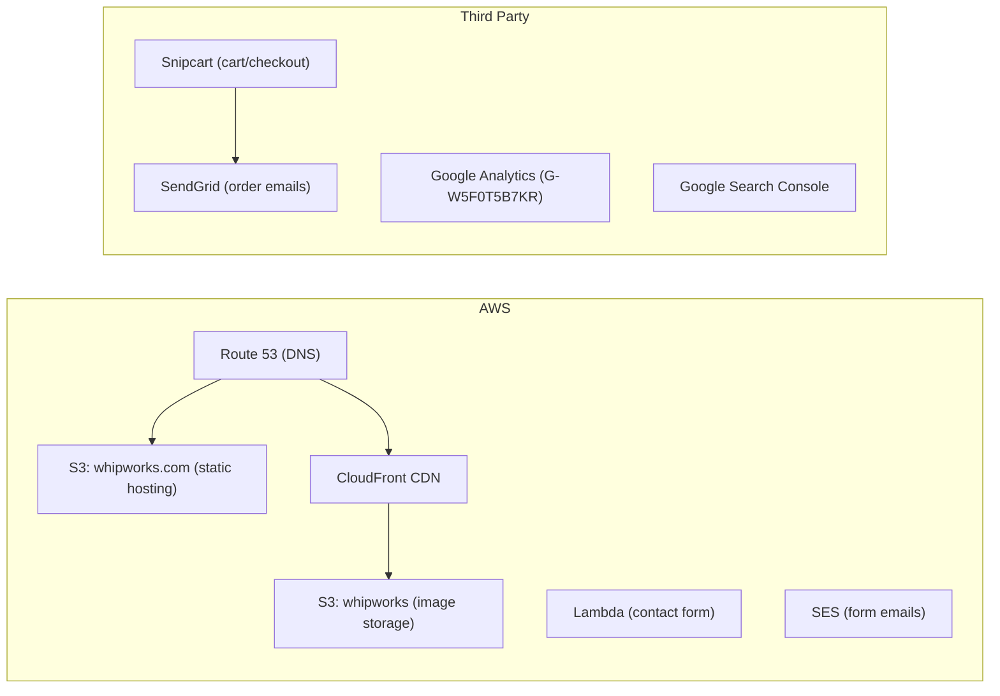
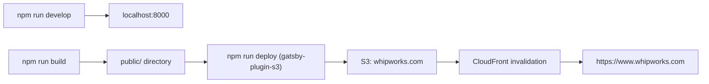

# WhipWorks.com - Architecture Reference

> **Last updated:** Phase 4B (Blacksmith's Bullwhip + rune customization) - April 2026
> This is a living document. Update after each phase of development.

## Site Map



### All Routes

| Route | Source | Template | Description |
|-------|--------|----------|-------------|
| `/` | `src/pages/index.tsx` | Layout | Homepage with hero carousel, featured whips |
| `/design-bullwhip` | `src/pages/design-bullwhip.tsx` | DesignerLayout | 3D bullwhip customizer |
| `/design-stockwhip` | `src/pages/design-stockwhip.tsx` | DesignerLayout | 3D stockwhip customizer |
| `/design-snakewhip` | `src/pages/design-snakewhip.tsx` | DesignerLayout | 3D snakewhip customizer |
| `/specialty-whips` | `src/pages/specialty-whips.tsx` | Layout | Specialty whips grid with hover crossfade |
| `/specialty/:slug` | gatsby-node.js | SpecialtyWhipPage | Individual specialty whip (x13) |
| `/accessories` | `src/pages/accessories.tsx` | Layout | Accessories listing |
| `/accessories/:slug` | gatsby-node.js | ProductPage | Individual accessory (x2) |
| `/whipmaking-materials` | `src/pages/whipmaking-materials.tsx` | Layout | Tools & materials listing |
| `/materials/:slug` | gatsby-node.js | ProductPage or ParacordPage | Individual material (x8) |
| `/whip-making-blueprints` | `src/pages/whip-making-blueprints.tsx` | Layout | Blueprint PDFs + YouTube series |
| `/about` | `src/pages/about.tsx` | Layout | About the Whipmaker — Adam's story, craft, YouTube embed |
| `/contact` | `src/pages/contact.tsx` | Layout | Contact form (react-hook-form -> Lambda) |
| `/reviews` | `src/pages/reviews.tsx` | Layout | Customer reviews with filters, blended sorting, AggregateRating JSON-LD |
| `/links` | `src/pages/links.tsx` | Standalone | Link-in-bio page (LinkTree replacement) |
| `/404` | `src/pages/404.tsx` | Layout | 404 error page |

## Component Architecture

```mermaid
graph TD
    subgraph Templates
        LAYOUT[Layout]
        HEADER[Header]
        CONTENT[Content]
        SEO[SEO]
        DESIGNER_LAYOUT[DesignerLayout]
        PRODUCT_PAGE[ProductPage]
        SPECIALTY_PAGE[SpecialtyWhipPage]
        PARACORD_PAGE[ParacordPage]
    end

    subgraph Organisms
        HERO[HeroCarousel]
        SPEC_LIST[SpecialtyWhipList]
        INSTA[InstagramFeed]
        CONTACT_FORM[ContactForm]
        REVIEW_CARD[ReviewCard]
        TESTIMONIAL[TestimonialStrip]

        subgraph BullwhipDesigner Suite
            BW[BullwhipDesigner]
            SW[StockwhipDesigner]
            SN[SnakewhipDesigner]
            PREVIEW[WhipPreview - Three.js]
            COLORS[WhipColors]
            HANDLE[HandleDesignPicker]
            CONCHO[ConchoPicker]
            COLLAR[CollarPicker]
            HEEL[HeelLoopPicker]
            FINISH[FinishPicker]
            GALLERY_BW[WhipGallery]
            GALLERY_SW[StockwhipGallery]
            GALLERY_SN[SnakewhipGallery]
            PRICE_BW[PriceBreakdown]
            PRICE_SW[PriceBreakdownStockwhip]
            PRICE_SN[PriceBreakdownSnakewhip]
        end
    end

    subgraph Molecules
        ACC_CARD[AccessoryCard]
        PROD_IMAGES[ProductImages]
        ADDED_MODAL[AddedToCartModal]
        BW_MODAL[BullwhipAddedModal]
    end

    subgraph Atoms
        CART_BTN[CartButton]
        CUSTOM_LABEL[CustomizationLabel]
        IMG_BTN[ImageButton]
        ACCORDION[AccordionSection]
        SPEC_CARD[SpecialtyWhipCard]
        GRID_CARD[SpecialtyWhipGridCard]
        STEP_NAV[StepNav]
        QTY[QuantitySelector]
        STOCK[StockIndicator]
        FULL_IMG[FullWidthImage]
    end

    LAYOUT --> HEADER
    LAYOUT --> CONTENT
    HEADER --> CART_BTN

    BW --> PREVIEW
    BW --> COLORS
    BW --> HANDLE
    BW --> CONCHO
    BW --> COLLAR
    BW --> HEEL
    BW --> PRICE_BW
    BW --> BW_MODAL
    BW --> GALLERY_BW

    SW --> PREVIEW
    SW --> PRICE_SW
    SW --> GALLERY_SW

    SN --> PREVIEW
    SN --> PRICE_SN
    SN --> GALLERY_SN

    GALLERY_BW --> TESTIMONIAL
    BW --> GALLERY_BW
    SN --> TESTIMONIAL
    SW --> TESTIMONIAL

    SPECIALTY_PAGE --> TESTIMONIAL

    SPEC_LIST --> GRID_CARD
    SPECIALTY_PAGE --> PROD_IMAGES
    PRODUCT_PAGE --> PROD_IMAGES
    PRODUCT_PAGE --> QTY
    PRODUCT_PAGE --> STOCK
```



### Component File Counts

| Layer | Count | Location |
|-------|-------|----------|
| Atoms | 10 | `src/components/atoms/` |
| Molecules | 4 | `src/components/molecules/` |
| Organisms | 6 top-level + 16 designer | `src/components/organisms/` |
| Templates | 8 | `src/components/templates/` |
| Constants | 15 | `src/components/organisms/BullwhipDesigner/constants/` |
| Hooks | 1 | `src/hooks/useStockLevel.ts` |

## Data Flow



### Snipcart Integration

Product variants defined in markdown frontmatter are converted to Snipcart custom field attributes by `resolveSnipcartFields()` in gatsby-node.js:

```
frontmatter.variants → data-item-custom1-name, data-item-custom1-options, data-item-custom1-value, etc.
```

These are embedded in the page context and rendered as button attributes by ProductPage/SpecialtyWhipPage.

**Gotchas (fixed during Blacksmith rollout):**
- The `createPages` GraphQL query **must select `variants.defaultValue`** — if missing, Snipcart falls back to the first-listed option as the cart default.
- `priceDiff` is coerced to `Number` at runtime; `resolveSnipcartFields` prepends `+` for positive values so Snipcart's `[+5]` / `[-5]` format stays valid.
- `priceDiff: '+0'` is treated as zero and omitted from the options string (a literal `[+0]` confuses Snipcart's option matcher).

## Three.js 3D Preview Pipeline



### Key Three.js Files

| File | Lines | Purpose |
|------|-------|---------|
| `WhipPreview.tsx` | ~200 | Scene setup, lighting, camera, drag interaction, texture updates |
| `drawBullwhipPreviews.ts` | ~600 | Canvas 2D pattern rendering (Box, Accent, Celtic, Herringbone, etc.) |

### Texture URL Pattern

```
https://d3ruufruf2uqog.cloudfront.net/paracordImages/{waxed|unwaxed}/{color}{Left|Right}{Waxed?}.jpg
```

## Content Structure



### Reviews Data (`src/data/reviews.json`)

```yaml
meta:
  totalReviews: 433
  averageRating: 4.94
  totalSales: 3172
  whipsCrafted: 1200
  source: "Etsy"
  lastScraped: "2026-04-12"
  photoNamingConvention: "reviews/review-{id}-{1,2,3}.jpg on S3"

reviews[]:
  id: Number            # Chronological (1 = earliest, 433 = newest)
  name: String
  stars: Number         # 1-5
  date: String          # YYYY-MM-DD
  product: String       # Product purchased
  productType: String   # bullwhip | stockwhip | snakewhip | specialty | flogger | blueprint | material | accessory | other
  specialtySlug: String # Only for specialty type — matches content slug
  text: String          # Review text (may be empty)
  hasPhoto: Boolean     # Customer photo on S3
  featured: Boolean     # Prioritized in sorting
  adamResponse: String  # Optional seller response
```

### Frontmatter Schema

Defined in `gatsby-node.js` via `createSchemaCustomization`:

```yaml
# All product types share:
title: String
id: String
description: String
price: Number
images:
  - url: String      # S3 URL
    caption: String   # Used as alt text (Phase 6B)

# Specialty whips add:
sortOrder: Number
headerImage: String   # Hero/OG image URL
seriesImage: String   # Series logo (e.g., 40K header)
series: String
hasStyles: Boolean
isNew: Boolean
weight: Number
specs:
  - label: String
    value: String
variants:
  - name: String
    defaultValue: String
    note: String          # Optional helper text shown below the dropdown
    chart: String         # Optional reference chart image URL (opens in ProductImages lightbox)
    options:
      - name: String
        priceDiff: Number
        images: [{ url, caption }]  # Per-variant images
```

**Description rendering:** `SpecialtyWhipPage` renders the markdown body HTML as the on-page description when present (allowing inline `<a>` tags, multiple paragraphs, etc.), and falls back to the plain-text `frontmatter.description` otherwise. The frontmatter `description` is still used for SEO/meta tags and Snipcart's `data-item-description`.

### Image Storage

| Location | Content | Example |
|----------|---------|---------|
| `whipworks.s3.us-east-2.amazonaws.com/gallery/specialty/` | Product photos | `BW602JB1Wide.jpg` |
| `d3ruufruf2uqog.cloudfront.net/paracordImages/` | Paracord color textures | `unwaxed/redLeft.jpg` |
| `d3ruufruf2uqog.cloudfront.net/specialty/` | Header/series logos | `40K/40KHeader.png` |
| `d3ruufruf2uqog.cloudfront.net/bannerImages/` | Hero/banner images | `heroImages/comoSunset800.jpg` |
| `whipworks.s3.us-east-2.amazonaws.com/reviews/` | Customer review photos | `review433.jpg` |
| `whipworks.s3.us-east-2.amazonaws.com/bannerImages/` | Social banners | `FB+Banner.jpg` |

### Shot Type Naming Convention (Gallery Images)

```
BW[number][WhipCode][Shot].jpg
```

Shot types: `Wide`, `Wide2`, `Transition`, `Thong`, `Handle`, `Handle2`, `Concho`, `Heel`

## External Services



| Service | Purpose | Config Location |
|---------|---------|-----------------|
| **S3** | Static site hosting + image storage | `gatsby-config.ts` (gatsby-plugin-s3) |
| **CloudFront** | CDN for images/textures | `d3ruufruf2uqog.cloudfront.net` |
| **Snipcart** | Shopping cart, checkout, inventory | `gatsby-config.ts` + `.env` (API key) |
| **GA4** | Analytics | `gatsby-config.ts` (G-W5F0T5B7KR) |
| **Search Console** | SEO monitoring | Verified via GA4 |
| **Lambda** | Contact form handler | Endpoint in ContactForm.tsx |
| **SES** | Contact form email delivery | `inquiries@whipworks.com` (us-east-2) |
| **SendGrid** | Snipcart order emails | `orders@whipworks.com`, authenticated domain |
| **Route 53** | DNS (SPF, CNAME for SendGrid/Mailgun) | AWS console |

## Build & Deploy



### Commands

```bash
npm run develop     # Local dev server (port 8000)
npm run build       # Production build -> public/
npm run deploy      # Deploy public/ to S3
```

### CloudFront Cache Invalidation

```bash
aws cloudfront create-invalidation --distribution-id E3JS36YMAEJ3WR --paths "/*"
```

### Worktree Development (Claude Code)

> **⚠ IMPORTANT: Do NOT use git worktrees.** Edit files directly in the main repo instead. Worktrees lock branches and cause cleanup issues — the orphaned worktree directory can't be deleted while Claude Code is running in it, blocking the user from checking out the branch in VS Code. If a worktree was created by the system, commit and push changes, then the user must manually clean up with `rmdir /s /q` and `git worktree prune` before they can access the branch.

If a worktree is unavoidable, `node_modules` are not shared from the main repo. **Do not run `npm install`** in the worktree — it will fail due to missing Python/node-gyp for native modules (`@parcel/watcher`).

Instead:

1. **Symlink `node_modules`** from the main repo:
   ```bash
   cmd //c "mklink /J node_modules C:\Users\atfie\Documents\GitHub\whipworks.com\node_modules"
   ```

2. **Use an alternate port** to avoid conflicts with the main repo's dev server. In `.claude/launch.json`:
   ```json
   {
     "version": "0.0.1",
     "configurations": [{
       "name": "dev",
       "runtimeExecutable": "npm",
       "runtimeArgs": ["run", "develop", "--", "-p", "8002"],
       "port": 8002
     }]
   }
   ```

3. **Gatsby takes ~90 seconds** to compile on first run. Verify with:
   ```bash
   curl -s -o /dev/null -w "%{http_code}" http://localhost:8002/
   ```

> **Note:** `preview_logs` may show "No logs yet" even when the server is running. Use `curl` to confirm.

## Styling & Theme

| Property | Value |
|----------|-------|
| UI Library | Chakra UI v2 |
| Color mode | Dark only (`#1a140f` background) |
| Body font | Josefin Sans Variable |
| Heading font | Domine Variable |
| Button style | `bg: blue.200`, hover: `blue.600`, dark text |
| Desktop breakpoint | 825px (`md: 51.5625em`) |
| Max content width | 1080px |
| Header height | ~80px (fixed position) |

Theme file: `src/@chakra-ui/gatsby-plugin/theme.ts`

## Key Files Quick Reference

| File | Purpose |
|------|---------|
| `gatsby-config.ts` | Plugins, site metadata, Snipcart API key, GA4, S3 deploy |
| `gatsby-node.js` | Page creation, schema types, Snipcart field mapping, image sitemap |
| `src/components/templates/Layout.tsx` | Main layout (header + content + footer) |
| `src/components/templates/Header.tsx` | Navigation (desktop dropdowns + mobile drawer) |
| `src/components/templates/SEO.tsx` | Meta tags, OG tags, structured data (JSON-LD) |
| `src/components/templates/DesignerLayout.tsx` | Split-panel layout for designer pages |
| `src/components/templates/SpecialtyWhipPage.tsx` | Specialty whip detail template + structured data |
| `src/components/templates/ProductPage.tsx` | Generic product page (accessories, materials) |
| `src/components/organisms/BullwhipDesigner/WhipPreview.tsx` | Three.js 3D handle preview |
| `src/components/organisms/BullwhipDesigner/constants/drawBullwhipPreviews.ts` | Canvas 2D pattern rendering |
| `src/components/organisms/BullwhipDesigner/constants/spoolColors.ts` | Paracord color definitions |
| `src/components/molecules/ProductImages.tsx` | Image gallery with lightbox |
| `src/data/reviews.json` | 433 Etsy reviews with meta stats (4.94 avg, productType, specialtySlug) |
| `src/components/organisms/TestimonialStrip.tsx` | Horizontal review strip with photos, click-to-expand modal |
| `src/components/organisms/ReviewCard.tsx` | Review card with stars, photo lightbox, Adam's response |
| `src/components/atoms/SpecialtyWhipGridCard.tsx` | Grid cards with hover crossfade |
| `src/@chakra-ui/gatsby-plugin/theme.ts` | Chakra UI theme overrides |
| `src/hooks/useStockLevel.ts` | Snipcart Products API stock lookup |
